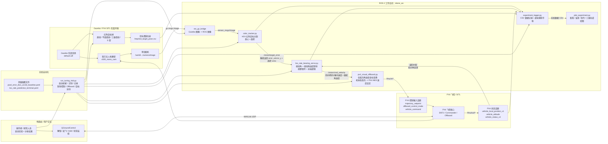

# 无人机视觉追击仿真系统架构

## 核心数据流

1. Gazebo 负责仿真我方无人机、单目相机和运动红色目标球。
2. `ros_gz_bridge` 将 Gazebo 相机图像转换为 ROS 2 图像话题。
3. `color_tracker.py` 通过 HSV 颜色阈值分割红色目标，输出目标质心、像素误差和面积。
4. `los_rate_bearing_servo.py` 将像素误差转换为视线角和视线角速度，生成前向、侧向、垂向和偏航角速度指令。
5. `px4_visual_offboard.py` 将视觉制导输出的机体系速度指令转换为 PX4 NED 速度设定值。
6. PX4 在 Offboard 模式下执行速度设定值，并驱动 Gazebo 中的无人机运动。
7. `experiment_logger.py` 同步记录图像误差、控制指令、PX4 状态、目标真值、相对距离和捕获状态。

## 核心算法

- 视觉识别：HSV 红色分割、轮廓筛选、质心提取、面积估计。
- 基线制导：`attitude_pn_bearing_servo.py` 中的像素误差 / IBVS 控制方法。
- 新版制导：`los_rate_bearing_servo.py` 中的视线角 + 视线角速度制导方法。
- 视野保持：目标接近图像边缘时降低前进速度，并增强横向/垂向修正。
- 末端逻辑：根据目标面积、视线偏差和捕获半径判断末端追击状态。
- Offboard 接口：仅使用航向角进行机体系到 NED 速度变换，避免机体俯仰导致前进速度耦合到高度方向。

## 通讯链路

- Gazebo 到 ROS 2：`ros_gz_bridge`
- ROS 2 到 PX4：`/fmu/in/trajectory_setpoint`、`/fmu/in/offboard_control_mode`、`/fmu/in/vehicle_command`
- PX4 到 ROS 2：`/fmu/out/vehicle_local_position_v1`、`/fmu/out/vehicle_attitude`、`/fmu/out/vehicle_status_v4`
- QGC 到 PX4：MAVLink UDP
- 目标真值到记录器：`/tmp/red_target_pose.csv`
